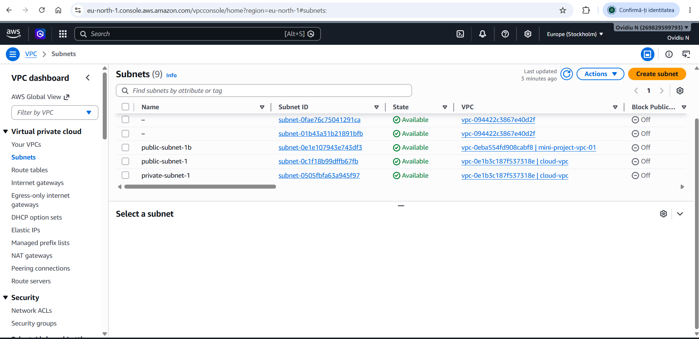
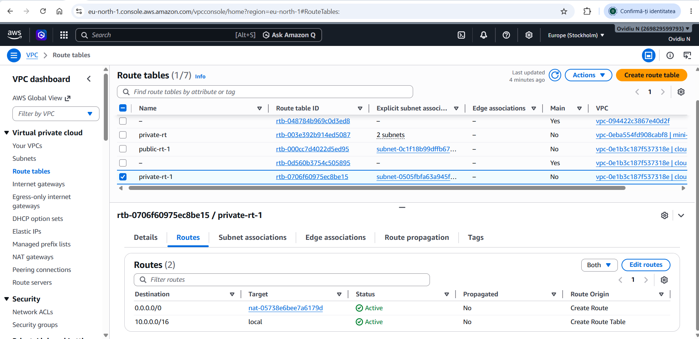
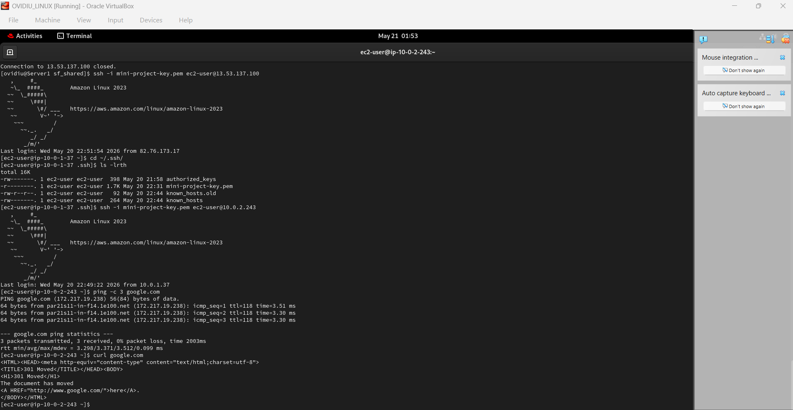
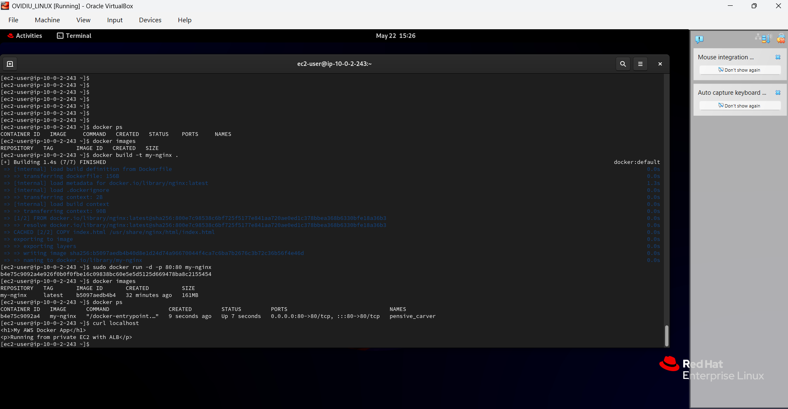
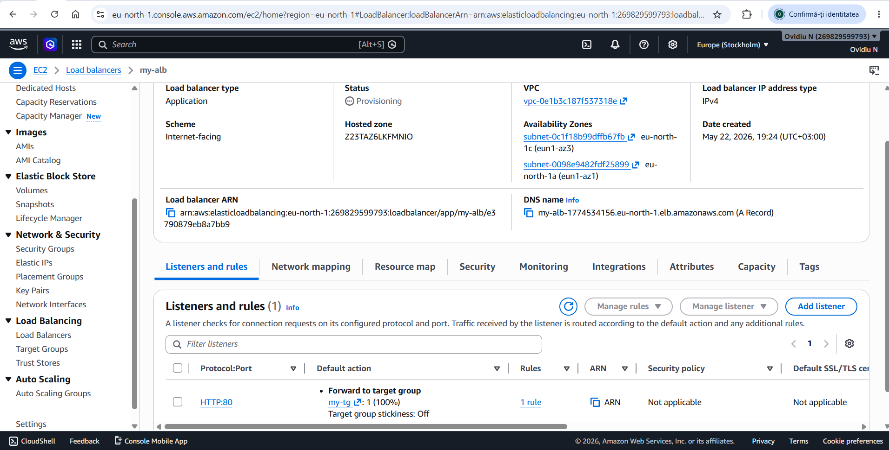
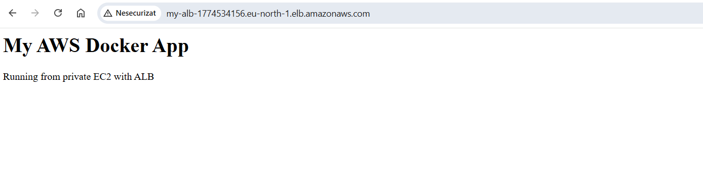

# AWS-Secure-Docker-Deployment-Private-EC2-ALB-

This project demonstrates a secure AWS architecture where a Dockerized web application is deployed on a private EC2 instance and exposed to the internet via an Application Load Balancer.

## Key Skills Demonstrated

- AWS VPC (public & private subnets)
- Secure architecture (private EC2 + bastion host)
- Application Load Balancer (ALB)
- NAT Gateway (outbound internet access)
- Docker (containerized deployment)
- Linux (Amazon Linux 2023)

---

## Implementation Overview

- Created custom VPC (10.0.0.0/16)
- Configured public & private subnets
- Attached Internet Gateway
- Configured route tables
- Deployed Bastion Host (public)
- Deployed EC2 in private subnet (no public IP)
- Installed Docker and built Nginx container
- Created custom Dockerfile and deployed Nginx-based application
- Configured NAT Gateway for internet access
- Created ALB and Target Group
- Connected ALB to private EC2
- Verified end-to-end connectivity

---

## Architecture

### Subnets (Public & Private)

---

## Networking

### Private Route Table (via NAT Gateway)

- Private EC2 does not have direct internet access
- Outbound traffic goes through NAT Gateway

---

## Secure Access

### Bastion Host → Private EC2

- SSH access only via bastion host
- Private EC2 is not exposed publicly

---

## Docker Deployment

### Container Running on Private EC2

- Built custom Nginx image
- Verified locally using `curl localhost`

---

## Load Balancing

### ALB Configuration (HTTP → Target Group)

- Internet-facing ALB
- Routes traffic to private EC2
- Health checks enabled

---

## Final Result

### Application accessed via ALB

---

## Architecture Flow

Internet → ALB → Private EC2 (Docker container)  
Bastion → SSH → Private EC2  
Private EC2 → NAT Gateway → Internet  

---

## Security

- No public IP on private EC2
- Access via Bastion Host only
- Security Groups with least privilege
- ALB handles public traffic

---

## Testing

- Verified Docker container locally
- Verified access via ALB DNS
- Confirmed traffic flow through ALB
- Confirmed outbound internet via NAT

## What This Project Proves

- Strong understanding of AWS networking
- Ability to deploy secure cloud architecture
- Hands-on experience with Docker in AWS
- Understanding of real-world infrastructure dependencies
